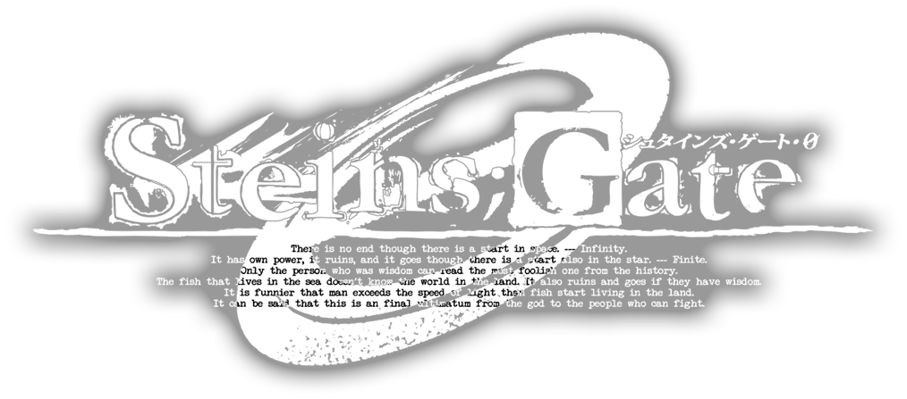

# STEINS;GATE 0 RenPSP

  

**THIS GAME IS AN UNOFFICIAL PORT OF THE STEINS;GATE 0 VISUAL NOVEL. ALL OF THE ASSETS INSIDE OF THE GAME ARE BELONGED TO 5PB.**
## Chapter Completion 
**Prologue** : 100% 
**Entropy Zero** : 35% 
**Closed Epigraph** : 0% 
**A Stray Sheep** : 0% 
**X-day Protocol** : 0% 
**The Orbital Eclipse** : 0% 
**Pandora's Box** : 0% 
**Twin Automata** : 0% 
**Gehenna's Stigma** : 0% 
**Antinomic Dual** : 0% 
**Presage or Recognize** : 0% 
**Recursive Mother Goose** : 0% 
**Promised Rinascimento** : 0% 
**Vega And Altair** : 0% 
**Milky-way Crossing** : 0% 

## Credits
5pb for making the original game.
PonpiK for helping me about the project.
weetabix for the RenPSP (https://github.com/weetabix-su/renpsp-dev/).
